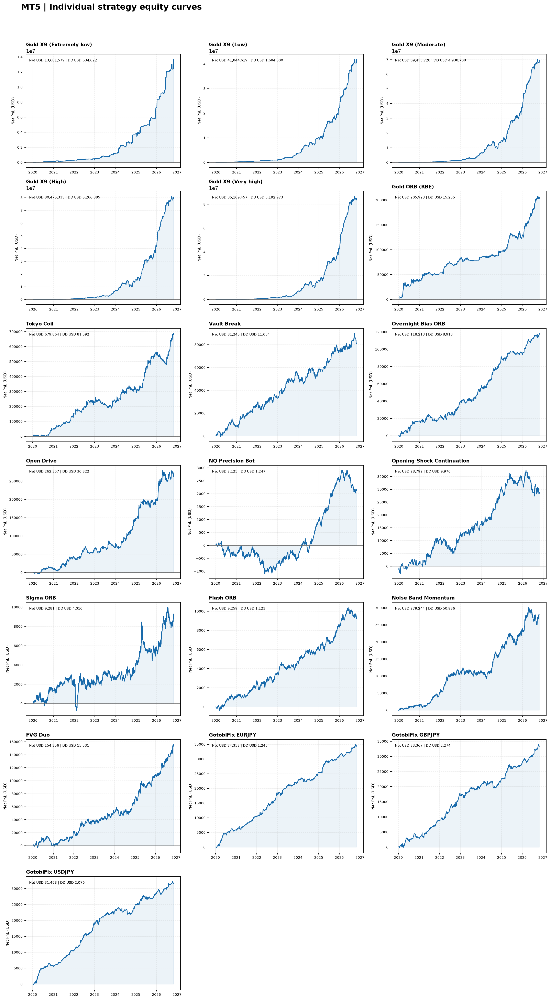
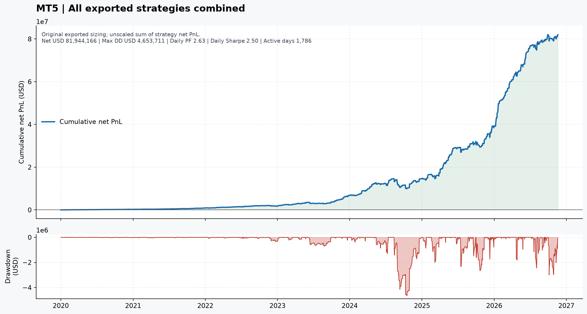

# MT5 research pack

**15 of 15 registered exports parsed.**

## Snapshot

| Portfolio | Net PnL | Max drawdown | Daily PF | Daily Sharpe |
|---|---:|---:|---:|---:|
| All 15 exports | $81,944,165.86 | $4,653,710.89 | 2.63 | 2.50 |
| Core 4 shortlist | $80,286,062.82 | $4,678,072.04 | 2.61 | 2.45 |

## Core shortlist

- Gold X9
- GotobiFix EURJPY
- GotobiFix USDJPY
- Gold ORB (RBE)

## Reports

- [Strategy metrics](reports/strategy_metrics.csv)
- [Portfolio metrics](reports/portfolio_metrics.csv)
- [Daily PnL](reports/daily_pnl.csv)
- [Daily PnL correlation matrix](reports/correlation_matrix.csv)
- [Annual PnL](reports/annual_pnl.csv)
- [Normalized event ledger](reports/normalized_event_ledger.csv)
- [Strategy manifest](reports/strategy_manifest.csv)
- [Data-quality checks](reports/data_quality.json)
- [Selection rationale](reports/recommendations.md)
- [Build summary](reports/summary.json)

MT5 standard reports use deal `Profit + Commission + Swap`; custom completed-trade ledgers use their adjusted net PnL. Timestamps are retained as exported broker/server time.

Instrument coverage: EURJPY; GBPJPY; USDJPY; USTEC; XAUUSD.

### Position sizing over time

These exports size from account balance rather than a fixed lot/contract. Their raw dollar curve is a compounding tester run at the reported initial deposit, not a fixed-size strategy comparison; the normalized live and prop-firm layers divide cash flow by traded volume to remove that effect.

| Strategy | Mean size, first year | Mean size, last year |
|---|---:|---:|
| Gold X9 | 0.46 | 51.47 |
| Tokyo Coil | 9.41 | 38.40 |

## Equity curves

### Individual-strategy dashboard

### All strategies combined

### Core shortlist

### Individual curves

- [Gold X9](charts/individual/gold-x9.png)
- [Gold ORB (RBE)](charts/individual/gold-orb-rbe.png)
- [Tokyo Coil](charts/individual/tokyo-coil.png)
- [Vault Break](charts/individual/vault-break.png)
- [Overnight Bias ORB](charts/individual/overnight-bias-orb.png)
- [Open Drive](charts/individual/open-drive.png)
- [NQ Precision Bot](charts/individual/nq-precision-bot.png)
- [Opening-Shock Continuation](charts/individual/opening-shock-continuation.png)
- [Sigma ORB](charts/individual/sigma-orb.png)
- [Flash ORB](charts/individual/flash-orb.png)
- [Noise Band Momentum](charts/individual/noise-band-momentum.png)
- [FVG Duo](charts/individual/fvg-duo.png)
- [GotobiFix EURJPY](charts/individual/gotobifix-eurjpy.png)
- [GotobiFix GBPJPY](charts/individual/gotobifix-gbpjpy.png)
- [GotobiFix USDJPY](charts/individual/gotobifix-usdjpy.png)
